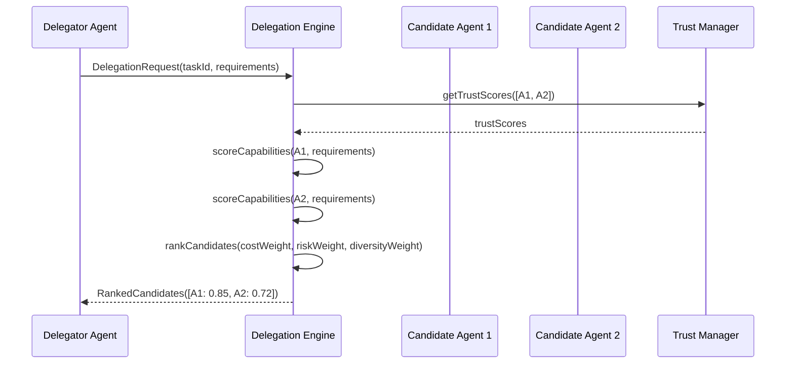
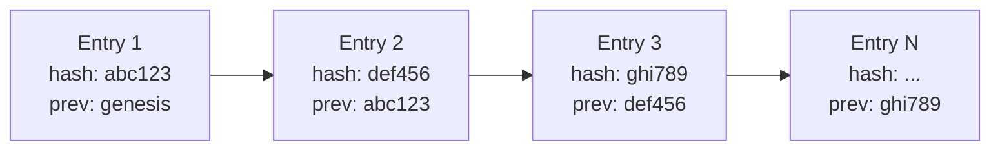
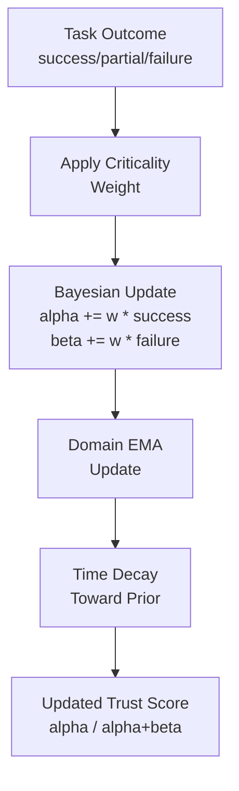
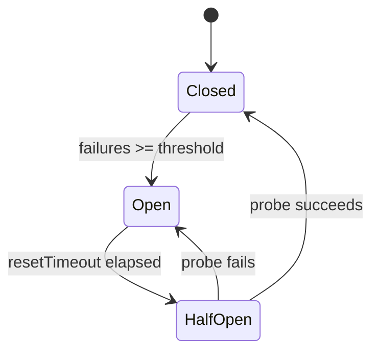
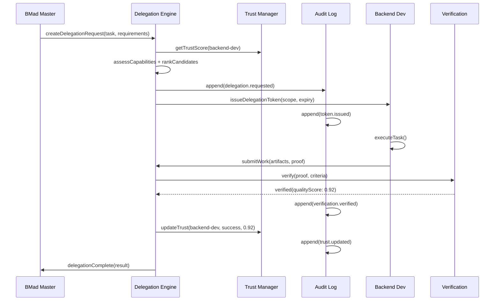

# VIADP -- Verified Inter-Agent Delegation Protocol

**Version**: 1.0
**Status**: Implementation
**Date**: 2026-02-28
**Reference**: Based on concepts from AI agent delegation research ([arXiv:2602.11865](https://arxiv.org/abs/2602.11865))

## Abstract

VIADP is a protocol for safe, transparent, and accountable delegation of tasks between AI agents in a multi-agent software development system. It provides five pillars of assurance: Dynamic Assessment, Adaptive Execution, Structural Transparency, Trust Calibration, and Systemic Resilience. The protocol governs how one agent discovers, selects, authorizes, monitors, and verifies work performed by another agent, while maintaining an immutable audit trail of every action.

## Table of Contents

1. [Overview](#1-overview)
2. [The Five Pillars](#2-the-five-pillars)
3. [Protocol Flow](#3-protocol-flow)
4. [Trust Model](#4-trust-model)
5. [Delegation Token Format](#5-delegation-token-format)
6. [Audit Trail](#6-audit-trail)
7. [Circuit Breakers and Resilience](#7-circuit-breakers-and-resilience)
8. [Implementation Details](#8-implementation-details)

---

## 1. Overview

ForgeTeam operates as a 12-agent autonomous SDLC team. Agents frequently need to delegate sub-tasks to peers whose capabilities better match the requirements. Without guardrails, delegation can lead to unbounded chains of authority, silent failures, and unaccountable decisions.

VIADP solves this by wrapping every delegation in a structured lifecycle:

1. **Request** -- a delegator publishes capability requirements.
2. **Assessment** -- candidates are scored on capability, cost, risk, and diversity.
3. **Authorization** -- a scoped, time-limited delegation token is issued.
4. **Execution** -- the delegate works under monitoring and checkpoints.
5. **Verification** -- the work is verified against acceptance criteria with proof submission.
6. **Trust Update** -- the delegation outcome feeds back into the Bayesian trust model.
7. **Audit** -- every step is appended to an immutable, hash-chained audit log.

---

## 2. The Five Pillars

### Pillar 1: Dynamic Assessment

**Source**: `viadp/src/delegation-engine.ts` -- `DelegationEngine.matchDelegates()`

Dynamic Assessment governs how the protocol discovers and ranks candidate agents for a delegation request. Rather than static role assignments, every delegation triggers a real-time, multi-objective evaluation.

#### Capability Scoring

The `assessCapability()` method scores each agent against the request's `capabilityRequirements` using a three-tier matching strategy:

| Match Type | Condition | Score |
|---|---|---|
| **Exact match** | Agent capability string equals the requirement (case-insensitive) | 1.0 |
| **Substring match** | Requirement contains capability or vice versa | `min(len) / max(len)` |
| **Word-level overlap** | Words from requirement and capability overlap | `commonWords / max(wordSets)` |

A partial match is accepted when `bestPartialScore >= 0.5`. The overall capability score is the mean of all per-requirement domain scores.

Confidence is computed as:

```
confidence = matchedRequirements / totalRequirements
```

#### Multi-Objective Optimization

`matchDelegates()` computes a composite score for every available candidate across four objectives:

```
compositeScore = capability * w_cap + costScore * w_cost + riskScore * w_risk + diversityBonus * w_div
```

**Cost score** (lower is better, normalized 0-1):

```
costScore = 1 - (agent.costPerToken - minCost) / costRange
```

**Risk score** (higher trust and lower load are better):

```
riskScore = (trustScore * 0.6 + loadFactor * 0.4) / riskMultiplier
```

Where `loadFactor = 1 - currentLoad / maxConcurrentTasks` and `riskMultiplier` scales with risk level:

| Risk Level | Multiplier |
|---|---|
| low | 1.0 |
| medium | 1.2 |
| high | 1.5 |
| critical | 2.0 |

**Diversity bonus** (penalizes same model family):

```
diversityBonus = 1 / (1 + familyCount * 0.3)
```

Where `familyCount` is the number of already-counted agents from the same model family.

#### Risk-Adaptive Weights

The weight vector shifts based on the task's risk level, prioritizing safety for critical tasks:

| Risk Level | Capability | Cost | Risk | Diversity |
|---|---|---|---|---|
| low | 0.40 | 0.30 | 0.15 | 0.15 |
| medium | 0.40 | 0.20 | 0.25 | 0.15 |
| high | 0.35 | 0.10 | 0.40 | 0.15 |
| critical | 0.30 | 0.05 | 0.50 | 0.15 |

#### Agent Filtering

Before scoring, the engine filters out agents that are:
- `offline` or in `error` state
- At maximum concurrent task capacity (`currentLoad >= maxConcurrentTasks`)
- The delegator themselves (no self-delegation)
- Agents with overall capability score below 0.1

Candidates are sorted by `compositeScore` descending and returned as `RankedCandidate[]`.



---

### Pillar 2: Adaptive Execution

**Source**: `viadp/src/delegation-engine.ts` -- `DelegationEngine.monitorExecution()`, `updateExecutionStatus()`, `redelegate()`

Adaptive Execution ensures that delegated tasks are continuously monitored, with mechanisms for checkpoints, anomaly detection, and automatic re-delegation on failure.

#### Execution Monitoring

When a delegation token is issued, the engine initializes an `ExecutionStatus` record:

```typescript
interface ExecutionStatus {
  delegationId: string;
  status: 'pending' | 'in_progress' | 'completed' | 'failed' | 'timed_out';
  progress: number;          // 0-100
  lastUpdate: Date;
  checkpoints: CheckpointStatus[];
  currentStep: string;
  estimatedCompletion: Date | null;
}
```

Consumers subscribe to status updates via `monitorExecution(delegationId, callback)`, which returns an unsubscribe function. The current status is emitted immediately upon subscription.

#### Checkpoints

Each checkpoint tracks:
- **name** -- descriptive label for the milestone
- **reached** -- boolean indicating completion
- **reachedAt** -- timestamp of completion
- **metrics** -- key-value pairs of numeric metrics collected at this point

#### Anomaly Detection and Re-delegation

When a delegate fails or times out, the engine supports automatic re-delegation:

1. The old delegation token is **revoked** (`token.revoked = true`).
2. The old agent's load is released.
3. The delegation **chain depth** is checked against `maxChainDepth`. For critical tasks, `maxChainDepth = 1` (no re-delegation); otherwise `maxChainDepth = 3`.
4. A new `matchDelegates()` call is made, **excluding** all agents already in the chain and the failed delegate.
5. The new token inherits the extended chain: `[...oldChain, newDelegate]`.
6. Re-delegation automatically raises risk level to `high` and requires `peer_review` verification with `requiredConfidence >= 0.7`.

#### Token Revocation

Any active token can be revoked via `revoke(delegationId)`. Revocation:
- Sets `token.revoked = true`
- Releases the agent's load counter
- Updates execution status to `failed`

---

### Pillar 3: Structural Transparency

**Source**: `viadp/src/audit-log.ts` -- `AuditLog`

Structural Transparency guarantees that every action in the delegation lifecycle is recorded in an append-only, tamper-evident audit log.

#### Immutable Hash Chain

Every `AuditEntry` is linked to its predecessor through a hash chain. Each entry contains:

| Field | Description |
|---|---|
| `id` | UUID v4 |
| `timestamp` | Date of entry creation |
| `type` | Typed action (see AuditAction below) |
| `delegationId` | Associated delegation |
| `from` | Source agent |
| `to` | Target agent |
| `action` | Human-readable action description |
| `data` | Arbitrary metadata |
| `hash` | FNV-1a hash of this entry |
| `previousHash` | Hash of the previous entry |
| `sequenceNumber` | Monotonically increasing counter |

The genesis entry uses `previousHash = 'genesis_000000000000'`.

#### FNV-1a Hash Algorithm

The hash is computed using an FNV-1a inspired algorithm over a pipe-delimited payload:

```
payload = hashSeed | id | timestamp | type | delegationId | from | to | action | JSON(data) | previousHash | sequenceNumber
```

```typescript
let hash = 0x811c9dc5;          // FNV offset basis
for (let i = 0; i < payload.length; i++) {
  hash ^= payload.charCodeAt(i);
  hash = (hash * 0x01000193) | 0; // FNV prime
}
// Output: "audit_{hex}_{base36_sequence}"
```

The resulting hash format is: `audit_XXXXXXXX_YYYYYY` where `X` is the 8-character hex hash and `Y` is the zero-padded base-36 sequence number.

#### In-Memory Immutability

Every entry is frozen upon append using `Object.freeze()`:

```typescript
this.entries.push(Object.freeze(auditEntry) as AuditEntry);
```

This prevents any in-process mutation of recorded entries.

#### PostgreSQL Persistence

In production, audit entries are persisted via INSERT-only rules in PostgreSQL (see `infrastructure/docker/init.sql`). The database schema mirrors the `AuditEntry` interface with columns for `hash` and `previous_hash`, enabling server-side chain verification.

The `AuditLog.fromDB()` static method reconstructs a log instance from database rows, restoring the hash chain state.

#### Integrity Verification

The `verifyIntegrity()` method walks the entire chain and checks three invariants for each entry:

1. `entry.previousHash === computedPreviousHash` -- chain linkage
2. `entry.hash === recomputedHash` -- entry hash matches content
3. `entry.sequenceNumber === expectedIndex` -- no gaps or reordering

Returns an `IntegrityReport`:

```typescript
interface IntegrityReport {
  valid: boolean;
  totalEntries: number;
  checkedEntries: number;
  firstBrokenAt: number | null;
  brokenEntries: number[];
  computeTimeMs: number;
}
```

#### Audit Action Types

The protocol defines the following action types:

| Category | Actions |
|---|---|
| **Delegation** | `delegation.requested`, `delegation.accepted`, `delegation.rejected`, `delegation.completed`, `delegation.failed`, `delegation.revoked`, `delegation.redelegated` |
| **Trust** | `trust.updated`, `trust.decayed`, `trust.reset` |
| **Verification** | `verification.created`, `verification.proof_submitted`, `verification.verified`, `verification.rejected` |
| **Resilience** | `circuit_breaker.opened`, `circuit_breaker.closed`, `circuit_breaker.half_open` |
| **Health** | `health_check.passed`, `health_check.failed` |
| **Consensus** | `consensus.reached`, `parallel_bid.completed` |



---

### Pillar 4: Trust Calibration

**Source**: `viadp/src/trust-manager.ts` -- `TrustManager`

Trust Calibration maintains a Bayesian trust model for every agent, updated after each delegation outcome. The model uses the Beta distribution as a conjugate prior for Bernoulli-like success/failure observations.

#### Bayesian Trust Model

Each agent's trust is represented by a **Beta(alpha, beta)** distribution:

```
Trust Score = alpha / (alpha + beta)     -- Beta distribution mean
Variance    = (alpha * beta) / ((alpha + beta)^2 * (alpha + beta + 1))
```

**Initial prior**: `Beta(2, 2)` with a mean score of `0.5`, representing maximum uncertainty with a slight bias toward neutrality. The `alpha = 2, beta = 2` prior is informative enough to prevent extreme scores from single observations.

#### Trust Update Rules

When a delegation outcome is recorded, the update weight is:

```
weight = max(0.1, taskCriticality) * criticalityWeight
```

Where `criticalityWeight` defaults to `1.5`.

The Bayesian update depends on the outcome:

| Outcome | Alpha Update | Beta Update |
|---|---|---|
| **success** | `alpha += weight` | -- |
| **failure** | -- | `beta += weight` |
| **partial** | `alpha += weight * 0.3` | `beta += weight * 0.7` |

After updating alpha and beta, the score is recalculated:

```
score = clamp(alpha / (alpha + beta), 0.05, 0.95)
```

The clamp to `[0.05, 0.95]` prevents any agent from reaching absolute zero or absolute certainty.

#### Task Criticality Weighting

Higher-criticality tasks have a proportionally larger effect on trust. The weight formula ensures that:
- A task with `criticality = 1.0` applies `1.5` units of evidence (default `criticalityWeight`).
- A task with `criticality = 0.1` still applies a minimum of `0.15` units.
- Critical bugs and security tasks carry more trust impact than routine documentation.

#### Exponential Time Decay

Trust scores decay toward the prior mean (`0.5`) over time using exponential decay:

```
decayFactor = exp(-decayRatePerDay * daysSinceLastTask)
score_new   = 0.5 + (score_old - 0.5) * decayFactor
```

Where `decayRatePerDay` defaults to `0.005`. This means:
- After 1 day of inactivity: score moves ~0.5% toward 0.5
- After 30 days: score moves ~14% toward 0.5
- After 100 days: score moves ~39% toward 0.5

The alpha and beta parameters also decay, but with a floor of their default values (`2, 2`):

```
paramDecay  = max(0.9, decayFactor)
alpha_new   = max(defaultAlpha, alpha_old * paramDecay)
beta_new    = max(defaultBeta,  beta_old  * paramDecay)
```

This "information decay" gradually returns the model toward its prior as observations become stale.

#### Domain-Specific Trust (EMA)

Beyond the global Bayesian score, each agent maintains per-domain trust scores updated via Exponential Moving Average (EMA):

```
learningRate = 0.1 * max(0.1, criticality)
domainScore_new = domainScore_old + learningRate * (target - domainScore_old)
```

Where `target` depends on outcome:

| Outcome | Target |
|---|---|
| success | 1.0 |
| partial | 0.4 |
| failure | 0.0 |

Domain scores are also subject to time decay, using the same `decayFactor` formula as the global score.

#### Trust Variance (Uncertainty)

The variance of the Beta distribution serves as a measure of uncertainty:

```
variance = (alpha * beta) / ((alpha + beta)^2 * (alpha + beta + 1))
```

High variance means fewer observations. The delegation engine can use variance to prefer agents with more certain trust scores, or to give new agents a chance by tolerating higher uncertainty.



---

### Pillar 5: Systemic Resilience

**Source**: `viadp/src/resilience.ts` -- `ResilienceEngine`

Systemic Resilience ensures the multi-agent system remains operational even when individual agents fail. It provides circuit breakers, parallel bid execution, diversity scoring, and health checks.

#### Circuit Breaker Pattern

Each agent has a circuit breaker with three states:

| State | Behavior |
|---|---|
| **Closed** | Normal operation. Failures are counted. |
| **Open** | Agent is excluded from delegation. No tasks are sent. |
| **Half-Open** | A limited number of probe tasks are allowed to test recovery. |

**Transition rules**:

- **Closed -> Open**: When `failureCount >= circuitBreakerThreshold` (default: 5).
- **Open -> Half-Open**: When `resetTimeout` elapses (default: 60 seconds). The success counter resets to 0.
- **Half-Open -> Closed**: When `successCount >= circuitBreakerHalfOpenMax` (default: 2 probe successes). All counters reset.
- **Half-Open -> Open**: Any failure in half-open state immediately re-opens the circuit with a **doubled** backoff period (`resetMs * 2`).

In the closed state, each success **decrements** the failure count by 1 (minimum 0), allowing gradual recovery without a full reset.



#### Parallel Bid Execution

For critical tasks, the engine can launch the same task across multiple agents in parallel using `parallelBid()`:

1. Select the top-K most diverse candidates via `selectDiverseTopK()`.
2. Execute the task function concurrently across all selected agents.
3. Each bid races against `parallelBidTimeoutMs` (default: 30 seconds).
4. Results are collected as `ParallelBidResult[]` with success/failure status and timing.

The best result is chosen via `consensusVote()`, which supports three methods:
- **Best quality**: Uses a provided `qualityScorer` function to rank results.
- **Majority (similarity-based)**: Serializes results and computes Jaccard similarity on character trigrams. The result with the most similar counterparts wins.
- **Weighted**: Combines quality scores with agreement metrics.

#### Shannon Entropy Diversity Scoring

The `diversityScore()` method evaluates how diverse a set of candidates is based on model family distribution:

```
entropy = -SUM(proportion_i * log2(proportion_i))   for each model family
normalizedEntropy = entropy / log2(totalCandidates)
familyRatio = uniqueFamilies / totalCandidates
score = normalizedEntropy * diversityWeight + familyRatio * (1 - diversityWeight)
```

Where `diversityWeight` defaults to `0.3`. A score of 1.0 means maximum diversity (all different model families); 0.0 means no diversity (all same family).

#### selectDiverseTopK Greedy Algorithm

When selecting K agents from a larger pool, the engine uses a greedy algorithm that balances trust and diversity:

```
for each selection slot:
  for each remaining candidate:
    familyCount = count of already-selected agents with same modelFamily
    diversityBonus = 1 / (1 + familyCount)
    score = candidate.trustScore * diversityBonus
  select the candidate with the highest score
```

This ensures high-trust agents are preferred, but agents from underrepresented model families get a proportional boost.

#### Health Checks

The `healthCheck()` method probes an agent's availability:
- If a custom `checkFn` is provided, it is raced against `healthCheckTimeoutMs` (default: 5 seconds).
- Otherwise, a basic check returns the circuit breaker state.
- Results are stored in a rolling history (last 100 checks per agent).

#### Economic Self-Regulation

The `applyEconomicSelfRegulation()` method adjusts task costs based on an agent's failure history:

```
heatMultiplier = 1 + (failureCount * 0.1)
costMultiplier = 1 + (heatMultiplier - 1) * 0.5
adjustedCost   = taskComplexity * costMultiplier
throttle       = heatMultiplier > 1.5
```

Agents with high failure rates face increased costs and may be throttled, creating a natural disincentive for unreliable behavior.

---

## 3. Protocol Flow

The complete delegation lifecycle, from request to trust update:



### Lifecycle Phases

**Phase 1 -- Request & Assessment**
1. The delegator (e.g., BMad Master) creates a `DelegationRequest` with task ID, capability requirements, risk level, deadline, and verification policy.
2. The request is validated against `DelegationRequestSchema` (Zod).
3. The engine filters available agents and scores each against capabilities, cost, risk, and diversity.
4. Candidates are ranked by composite score and returned.

**Phase 2 -- Authorization**
1. The top-ranked candidate is selected.
2. A `DelegationToken` is issued with a scoped set of permissions, resource limits, and an expiration matching the deadline.
3. The token includes a hash-based signature for integrity verification.
4. The delegate's load counter is incremented.

**Phase 3 -- Execution & Monitoring**
1. An `ExecutionStatus` is initialized with status `pending`.
2. The delegate begins work. Status updates flow through `updateExecutionStatus()`.
3. Subscribers receive real-time status notifications.
4. If the deadline passes, status transitions to `timed_out`.

**Phase 4 -- Verification**
1. The delegate submits work artifacts, a summary, and metrics.
2. The verification engine evaluates completeness:
   - Artifacts present: +0.4 confidence
   - Summary present: +0.3 confidence
   - Metrics present: +0.3 confidence
3. Verification passes if confidence >= 0.5.
4. For higher-assurance policies (peer review, consensus, proof-based), the `VerificationEngine` manages reviewer assignments and proof validation.

**Phase 5 -- Trust Update & Audit**
1. The delegation outcome (success/partial/failure) is fed to the Trust Manager.
2. Bayesian parameters are updated based on criticality-weighted evidence.
3. Domain-specific scores are updated via EMA.
4. Every action is recorded in the audit log with hash chain integrity.

---

## 4. Trust Model

### Mathematical Foundation

The trust model is grounded in Bayesian inference using the Beta-Bernoulli conjugate pair:

**Prior**: Beta(alpha_0, beta_0) = Beta(2, 2)

**Posterior after n observations**:

```
alpha_n = alpha_0 + SUM(w_i * s_i)    where s_i = 1 for success, 0.3 for partial, 0 for failure
beta_n  = beta_0  + SUM(w_i * f_i)    where f_i = 0 for success, 0.7 for partial, 1 for failure
w_i     = max(0.1, criticality_i) * criticalityWeight
```

**Point estimate (mean)**:

```
E[theta] = alpha_n / (alpha_n + beta_n)
```

**Uncertainty (variance)**:

```
Var[theta] = (alpha_n * beta_n) / ((alpha_n + beta_n)^2 * (alpha_n + beta_n + 1))
```

### Configuration

| Parameter | Default | Description |
|---|---|---|
| `defaultAlpha` | 2 | Initial alpha for Beta prior |
| `defaultBeta` | 2 | Initial beta for Beta prior |
| `maxHistoryLength` | 200 | Maximum trust events stored per agent |
| `decayRatePerDay` | 0.005 | Exponential decay rate |
| `minScore` | 0.05 | Floor for trust score |
| `maxScore` | 0.95 | Ceiling for trust score |
| `criticalityWeight` | 1.5 | Multiplier for task criticality |

### Trust Queries

The Trust Manager exposes the following queries:
- `getTrustScore(agentId)` -- current trust state
- `getTrustMatrix()` -- all agents with global average
- `getTrustVariance(agentId)` -- uncertainty measure
- `isTrustworthy(agentId, threshold)` -- boolean check (default threshold: 0.3)
- `getTopAgents(n)` -- top-N by trust score
- `getLowTrustAgents(threshold)` -- candidates for circuit breaking
- `exportScores()` / `importScores()` -- persistence support

---

## 5. Delegation Token Format

**Source**: `shared/types/viadp.ts` -- `DelegationToken`

A delegation token is a cryptographically signed authorization grant from one agent to another.

```typescript
interface DelegationToken {
  /** Unique token identifier (UUID v4) */
  id: string;
  /** The agent granting authority */
  delegator: AgentId;
  /** The agent receiving authority */
  delegate: AgentId;
  /** Task ID being delegated */
  taskId: string;
  /** Session context */
  sessionId: string;
  /** Scope of delegated authority */
  scope: DelegationScope;
  /** When this token was issued (ISO 8601) */
  issuedAt: string;
  /** When this token expires (ISO 8601) */
  expiresAt: string;
  /** Whether the token has been revoked */
  revoked: boolean;
  /** Unique signature for verification */
  signature: string;
  /** Chain of delegation (if re-delegated) */
  chain: AgentId[];
  /** Maximum allowed re-delegation depth */
  maxChainDepth: number;
}
```

### Delegation Scope

The scope constrains what the delegate can do:

```typescript
interface DelegationScope {
  /** Specific actions permitted (mapped from capabilityRequirements) */
  allowedActions: string[];
  /** Resource constraints */
  resourceLimits: {
    maxTokens?: number;     // Maximum LLM tokens
    maxDuration?: number;   // Maximum minutes
    maxCost?: number;       // Maximum cost in credits
  };
  /** Whether the delegate can further delegate */
  canRedelegate: boolean;
  /** Artifact types the delegate can produce */
  allowedArtifactTypes: string[];  // ['document', 'code', 'diagram', 'test', 'config']
}
```

### Risk-Based Scope Defaults

| Risk Level | maxTokens | maxDuration (min) | canRedelegate | Default maxCost |
|---|---|---|---|---|
| low | 100,000 | 60 | yes | 10 |
| medium | 50,000 | 30 | yes | 5 |
| high | 30,000 | 15 | no | 3 |
| critical | 20,000 | 10 | no | 2 |

### Token Signature

The token signature is a deterministic hash of `tokenId:taskId:delegator:delegate:timestamp`, using a simple string hash. The format is `sig_{base36_hash}_{tokenId_prefix}`.

### Re-delegation Chain

The `chain` field tracks every agent that has held authority:
- Initial delegation: `chain = [delegator, delegate]`
- After re-delegation: `chain = [delegator, firstDelegate, secondDelegate]`
- Chain depth is bounded by `maxChainDepth` (1 for critical tasks, 3 otherwise)

---

## 6. Audit Trail

### Entry Structure

Every auditable action produces an `AuditEntry`:

```typescript
interface AuditEntry {
  id: string;                    // UUID v4
  timestamp: Date;               // Entry creation time
  type: AuditAction;             // Typed action category
  delegationId: string;          // Associated delegation
  from: string;                  // Source agent
  to: string;                    // Target agent
  action: string;                // Human-readable description
  data: Record<string, unknown>; // Structured metadata
  hash: string;                  // FNV-1a hash of this entry
  previousHash: string;          // Hash of predecessor
  sequenceNumber: number;        // Monotonic counter
}
```

### Query and Export

The audit log supports:
- **Filtered queries**: by delegation ID, agent ID, action type, date range, with limit/offset pagination.
- **Sequence range queries**: retrieve entries by sequence number range.
- **Recent entries**: last N entries.
- **JSON export**: full structured export with metadata.
- **CSV export**: tabular export with proper escaping.
- **Statistics**: counts by type and agent, date range, integrity status.

### Import with Verification

The `importLog()` method accepts previously exported JSON and verifies hash chain continuity before accepting each entry. Entries with broken chain links are rejected with detailed error messages.

---

## 7. Circuit Breakers and Resilience

### Circuit Breaker Configuration

| Parameter | Default | Description |
|---|---|---|
| `circuitBreakerThreshold` | 5 | Failures before circuit opens |
| `circuitBreakerResetMs` | 60,000 | Time before open -> half-open (ms) |
| `circuitBreakerHalfOpenMax` | 2 | Successes to close from half-open |
| `healthCheckTimeoutMs` | 5,000 | Health check timeout (ms) |
| `diversityPenaltyWeight` | 0.3 | Weight for entropy in diversity score |
| `parallelBidTimeoutMs` | 30,000 | Timeout per parallel bid (ms) |

### Circuit Breaker State

```typescript
interface CircuitBreakerState {
  agentId: string;
  state: 'closed' | 'open' | 'half_open';
  failureCount: number;
  successCount: number;
  lastFailure: Date | null;
  lastSuccess: Date | null;
  openedAt: Date | null;
  halfOpenAt: Date | null;
  nextRetryAt: Date | null;
}
```

### Integration with Trust

Low-trust agents (below threshold 0.3) are flagged by `TrustManager.getLowTrustAgents()`. The delegation engine can combine this with circuit breaker state to make routing decisions. An agent with an open circuit breaker is excluded from `matchDelegates()` via the `isAgentAvailable()` check.

---

## 8. Implementation Details

### Verification Policies

**Source**: `viadp/src/verification.ts` -- `VerificationEngine`

The protocol supports four verification policies with increasing rigor:

| Policy | Description | Max Confidence |
|---|---|---|
| **self_report** | Delegate submits proof; auto-evaluated if valid | 0.70 |
| **peer_review** | One or more reviewers evaluate; majority decides | 1.00 |
| **consensus** | Multiple reviewers with configurable approval threshold (default 66%) | 1.00 |
| **proof** | All submitted proofs must pass deep verification | 1.00 |

#### Proof Types

Proofs are structured evidence submitted by delegates:

| Type | Required Fields | Max Confidence Contribution |
|---|---|---|
| `test_result` | `passed`, optionally `coverage` | 0.3 (+ 0.1 if coverage >= 80%) |
| `artifact` | `artifactId` or `content` | 0.2 (+ 0.1 if content > 100 chars) |
| `metric` | `metricName`, `value` | 0.2 |
| `log` | `entries` or `logContent` | 0.15 |
| `attestation` | (attestation fields only) | 0.1 |

Deep verification also adds:
- +0.3 for valid proof structure
- +0.2 for attestation freshness (within 24 hours)

#### Verification Proof (shared types)

```typescript
interface VerificationProof {
  id: string;
  delegationTokenId: string;
  delegate: AgentId;
  verifier: AgentId;
  status: 'pending' | 'verified' | 'rejected' | 'needs-revision';
  artifacts: string[];
  criteriaResults: CriteriaResult[];
  qualityScore: number | null;
  comments: string;
  submittedAt: string;
  verifiedAt: string | null;
}
```

### Delegation Request (shared types)

The full delegation request as defined in `shared/types/viadp.ts`:

```typescript
interface DelegationRequest {
  id: string;
  from: AgentId;
  to: AgentId;
  taskId: string;
  sessionId: string;
  status: DelegationStatus;
  reason: string;
  capabilityScore: number;
  riskLevel: RiskLevel;
  riskFactors: string[];
  proposedScope: DelegationScope;
  checkpoints: DelegationCheckpoint[];
  escalation: EscalationConfig;
  tokenId: string | null;
  createdAt: string;
  respondedAt: string | null;
  completedAt: string | null;
}
```

### Escalation Configuration

Delegations include escalation rules:

```typescript
interface EscalationConfig {
  timeoutMinutes: number;     // Auto-escalation timeout
  minTrustScore: number;      // Escalate if trust drops below
  maxFailures: number;        // Max failures before escalation
  escalateTo: AgentId;        // Target for escalation
  autoEscalate: boolean;      // Auto vs. manual escalation
}
```

### Source File Map

| Module | Path | Responsibility |
|---|---|---|
| Delegation Engine | `viadp/src/delegation-engine.ts` | Capability matching, token issuance, monitoring, re-delegation |
| Trust Manager | `viadp/src/trust-manager.ts` | Bayesian trust, decay, domain scores |
| Verification | `viadp/src/verification.ts` | Proof submission, review, auto-evaluation |
| Resilience | `viadp/src/resilience.ts` | Circuit breakers, parallel bids, diversity |
| Audit Log | `viadp/src/audit-log.ts` | Immutable hash chain, filtering, export |
| Shared Types | `shared/types/viadp.ts` | Protocol-wide type definitions |
