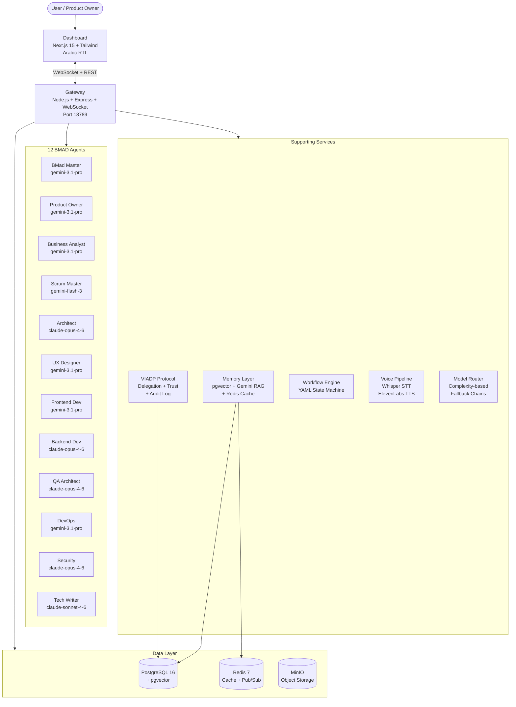
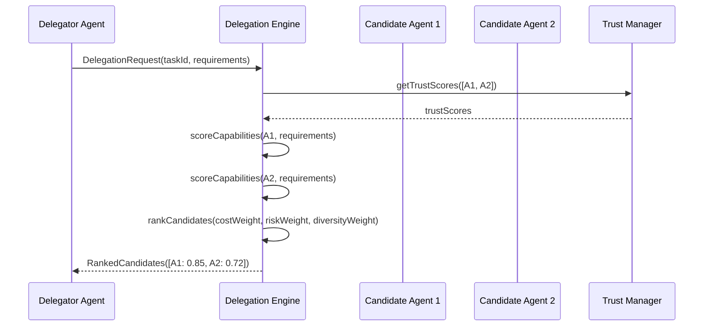
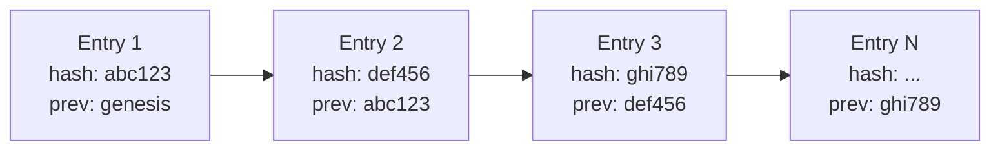
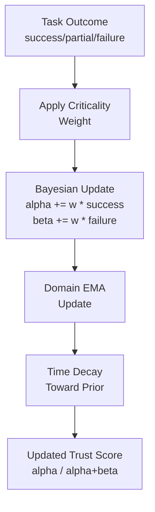
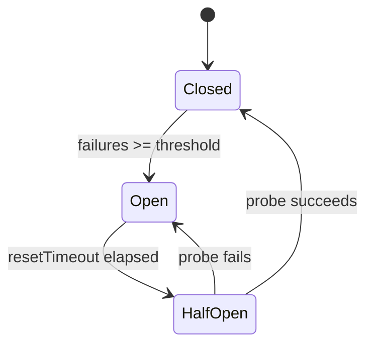
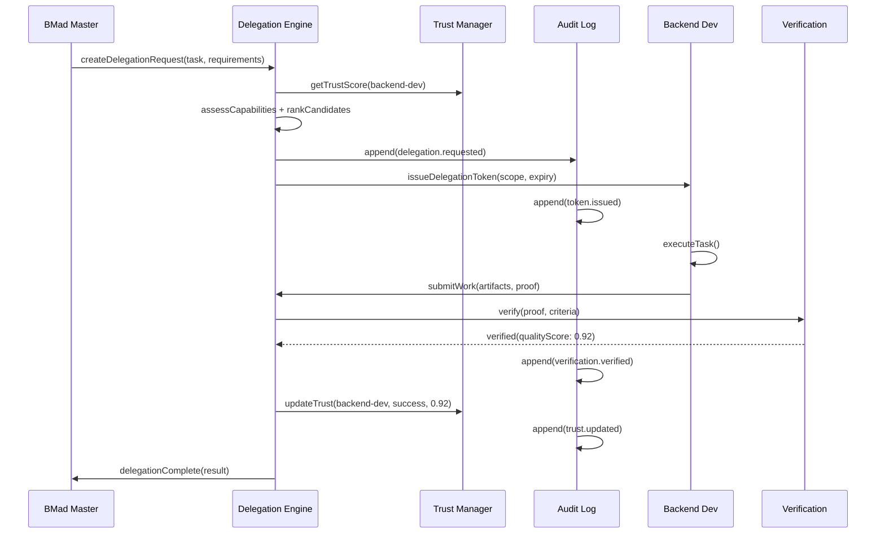
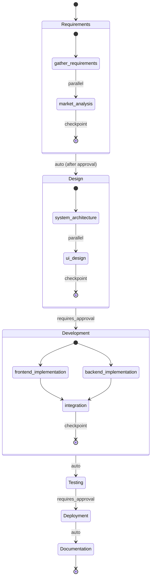
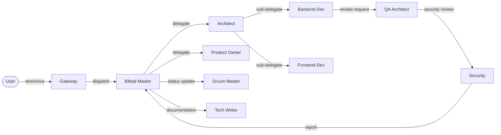

# Session 13 — Phase 12: Documentation & Handover (Day 14-15)

> **Instructions for Claude Code Opus 4.6**: Read this entire prompt before taking any action. You must complete ALL tasks listed below in the ForgeTeam project at `/Users/bandar/Documents/AreebPro/forge-team/`. Use the **team/swarm feature** — create a team and spin up parallel agents to work on independent workstreams simultaneously. Each workstream is labeled. Do NOT skip any item. Do NOT introduce new features beyond what is listed. Do NOT add comments, docstrings, or type annotations to code you did not change. Preserve the existing file structure and conventions.

---

## CONTEXT

The ForgeTeam audit report (AUDIT-REPORT.md) identified documentation gaps:

- **README** has an ASCII architecture diagram but no Mermaid diagrams. The agent model table is **outdated and incorrect** (e.g., lists Architect as `gemini-3.1-pro` when it actually uses `claude-opus-4-6`).
- **No API documentation** — no OpenAPI spec, no WebSocket event reference, no REST endpoint docs.
- **No deployment guide** — only basic Docker Compose quick start in README.
- **No standalone VIADP spec** — the protocol is only briefly described in README (lines 165-178).
- **Workflow YAMLs** lack documentation comments explaining their structure.

This session creates comprehensive documentation: a rewritten README with Mermaid diagrams, full API reference, deployment guide, VIADP specification, and inline workflow documentation.

---

## PRE-WORK: Read These Files First (Before Any Edits)

Every agent on the team must read the files relevant to their workstream before editing. The ground-truth references are:

**Architecture (mandatory reading for README and diagrams):**
- `/forge-team/gateway/src/index.ts` — all REST endpoints, Socket.IO events, server structure
- `/forge-team/gateway/src/model-router.ts` — canonical model catalog (lines 33-104) and agent assignments (lines 110-171)
- `/forge-team/gateway/src/server.ts` — WebSocket message types and handlers
- `/forge-team/gateway/src/session-manager.ts` — session lifecycle
- `/forge-team/gateway/src/task-manager.ts` — task CRUD, Kanban board
- `/forge-team/gateway/src/agent-manager.ts` — agent registry
- `/forge-team/gateway/src/viadp-engine.ts` — delegation protocol in gateway
- `/forge-team/gateway/src/workflow-engine.ts` — YAML workflow execution
- `/forge-team/gateway/src/voice-handler.ts` — STT/TTS pipeline
- `/forge-team/gateway/src/agent-runner.ts` — agent LLM execution

**VIADP protocol (mandatory for VIADP spec):**
- `/forge-team/viadp/src/delegation-engine.ts` — capability matching, multi-objective scoring, delegation tokens
- `/forge-team/viadp/src/trust-manager.ts` — Bayesian trust (Beta distribution), decay, domain scores
- `/forge-team/viadp/src/verification.ts` — proof verification, acceptance criteria
- `/forge-team/viadp/src/resilience.ts` — circuit breakers, parallel bids, diversity scoring
- `/forge-team/viadp/src/audit-log.ts` — hash chain, Object.freeze, integrity verification
- `/forge-team/shared/types/viadp.ts` — all VIADP type definitions

**Memory layer:**
- `/forge-team/memory/src/memory-manager.ts` — hierarchical scopes, store, search
- `/forge-team/memory/src/summarizer.ts` — auto-summarization
- `/forge-team/memory/src/gemini-file-search.ts` — Gemini RAG
- `/forge-team/memory/src/vector-store.ts` — pgvector similarity search

**Infrastructure:**
- `/forge-team/docker/docker-compose.yml` — Docker Compose services
- `/forge-team/infrastructure/init.sql` — database schema
- `/forge-team/infrastructure/k8s/` — Kubernetes manifests (if created in Session 11)
- `/forge-team/infrastructure/helm/` — Helm chart (if created in Session 11)

**Dashboard:**
- `/forge-team/dashboard/src/app/page.tsx` — main page structure
- `/forge-team/dashboard/package.json` — dashboard dependencies

**Workflow definitions:**
- `/forge-team/workflows/full-sdlc.yaml`
- `/forge-team/workflows/bug-fix.yaml`
- `/forge-team/workflows/feature-sprint.yaml`
- `/forge-team/workflows/security-review.yaml`

**Existing docs:**
- `/forge-team/README.md` — current README (to be rewritten)

**Shared types (for API schema documentation):**
- `/forge-team/shared/types/agent.ts`
- `/forge-team/shared/types/task.ts`
- `/forge-team/shared/types/workflow.ts`
- `/forge-team/shared/types/viadp.ts`
- `/forge-team/shared/types/memory.ts`
- `/forge-team/shared/types/models.ts`

---

## WORKSTREAM 1: Rewrite README.md

**Files to modify:**
- `/forge-team/README.md`

### 1A. Rewrite the full README

Replace the entire contents of `/forge-team/README.md` with a comprehensive document. The README must include ALL of the following sections in this order:

**1. Header and badges**
```markdown
# ForgeTeam

> Autonomous 12-agent SDLC platform powered by BMAD-METHOD + VIADP protocol

Orchestrates the full software development lifecycle — from discovery through deployment — using AI agents coordinated through the Verified Inter-Agent Delegation Protocol (VIADP).
```

**2. Mermaid Architecture Diagram**

Replace the ASCII diagram with this Mermaid flowchart. Read `gateway/src/index.ts` to verify all connections are accurate:



Verify every connection in this diagram matches the actual code. Adjust if any connections are wrong.

**3. Agent Model Assignment Table**

This is the **correct** table. The current README table is wrong. Replace it completely:

```markdown
| # | Agent | Role | Primary Model | Fallback Model | Tier |
|---|-------|------|---------------|----------------|------|
| 1 | bmad-master | Orchestrator / Team Lead | gemini-3.1-pro | claude-sonnet-4-6 | Balanced |
| 2 | product-owner | Requirements & Prioritization | gemini-3.1-pro | claude-sonnet-4-6 | Balanced |
| 3 | business-analyst | Research & Analysis | gemini-3.1-pro | claude-sonnet-4-6 | Balanced |
| 4 | scrum-master | Agile Coordination | gemini-flash-3 | claude-haiku-4-5 | Fast |
| 5 | architect | System Design | claude-opus-4-6 | gemini-3.1-pro | Premium |
| 6 | ux-designer | User Experience | gemini-3.1-pro | claude-sonnet-4-6 | Balanced |
| 7 | frontend-dev | Frontend Code | gemini-3.1-pro | claude-sonnet-4-6 | Balanced |
| 8 | backend-dev | Backend & APIs | claude-opus-4-6 | claude-sonnet-4-6 | Premium |
| 9 | qa-architect | Testing & QA | claude-opus-4-6 | claude-sonnet-4-6 | Premium |
| 10 | devops-engineer | CI/CD & Infrastructure | gemini-3.1-pro | claude-sonnet-4-6 | Balanced |
| 11 | security-specialist | Security & Compliance | claude-opus-4-6 | gemini-3.1-pro | Premium |
| 12 | tech-writer | Documentation | claude-sonnet-4-6 | gemini-3.1-pro | Balanced |
```

Add a note: "Only Anthropic and Google models are used. No GPT or Grok models."

**4. Key Modules section**

Brief descriptions of each module. Read the actual source code to verify descriptions:

- **Gateway** (`gateway/`) — central Node.js/TypeScript server with Express HTTP + WebSocket. Model router with complexity-based selection. Voice pipeline. REST API + Socket.IO real-time events.
- **Dashboard** (`dashboard/`) — Next.js 15 App Router with Tailwind 4. Full Arabic RTL support with Noto Sans Arabic. Real-time Kanban board (drag-and-drop), agent status grid, message feed, workflow tracker, cost dashboard, VIADP audit log, memory explorer, voice transcripts. Dark mode. Mobile responsive.
- **Memory** (`memory/`) — hierarchical memory: Company > Team > Project > Agent > Thread. Backed by PostgreSQL pgvector for semantic search, Gemini File Search for RAG, Redis for caching. Auto-summarization every 50 turns.
- **VIADP** (`viadp/`) — Verified Inter-Agent Delegation Protocol. 5 pillars: Dynamic Assessment, Adaptive Execution, Structural Transparency, Trust Calibration, Systemic Resilience. Bayesian trust (Beta distribution), circuit breakers, parallel bids, immutable hash-chain audit log.
- **Workflows** (`workflows/`) — BMAD YAML blueprints with phases, steps, agent assignments, model overrides, approval gates, parallel execution, checkpoints.
- **Shared** (`shared/`) — TypeScript type definitions used across all packages.

**5. Installation and Quick Start**

```markdown
## Prerequisites

- Docker and Docker Compose
- Node.js 22+
- API keys for Anthropic and Google AI

## Quick Start (Docker Compose)

1. Clone and configure:
   ```bash
   cd forge-team
   cp .env.example .env
   # Edit .env with your API keys
   ```

2. Start all services:
   ```bash
   cd docker
   docker compose up -d
   ```

   This starts:
   - **PostgreSQL** (pgvector) on port 5432
   - **Redis** on port 6379
   - **MinIO** on port 9000 (console: 9001)
   - **Gateway** on port 18789
   - **Dashboard** on port 3000

3. Open the dashboard: http://localhost:3000

## Local Development (without Docker)

Start infrastructure only:
```bash
cd docker
docker compose up -d postgres redis minio
```

Then run gateway and dashboard:
```bash
# Terminal 1: Gateway
cd gateway && npm install && npm run dev

# Terminal 2: Dashboard
cd dashboard && npm install && npm run dev
```
```

**6. Environment Variables Reference**

Document every environment variable used across the system. Read `docker-compose.yml` and `gateway/src/index.ts` to compile the complete list:

| Variable | Default | Description |
|----------|---------|-------------|
| `GATEWAY_PORT` | `18789` | Gateway HTTP/WS port |
| `GATEWAY_HOST` | `0.0.0.0` | Gateway bind address |
| `DATABASE_URL` | (see compose) | PostgreSQL connection string |
| `REDIS_URL` | `redis://redis:6379` | Redis connection string |
| `ANTHROPIC_API_KEY` | (required) | Anthropic API key for Claude models |
| `GOOGLE_AI_API_KEY` | (required) | Google AI API key for Gemini models |
| `ELEVENLABS_API_KEY` | (optional) | ElevenLabs API key for TTS |
| `WHISPER_API_KEY` | (optional) | OpenAI API key for Whisper STT |
| `MINIO_ENDPOINT` | `localhost:9000` | MinIO/S3 endpoint |
| `MINIO_ACCESS_KEY` | `forgeteam-admin` | MinIO access key |
| `MINIO_SECRET_KEY` | (required) | MinIO secret key |
| `MINIO_BUCKET` | `forgeteam-artifacts` | Default artifact bucket |
| `DEPLOYMENT_REGION` | `riyadh` | Deployment region identifier |
| `NODE_ENV` | `development` | Node.js environment |

**7. Project Structure**

Full directory tree (verify against actual files):

```
forge-team/
  agents/                    # 12 BMAD agent configurations
    bmad-master/             #   - config.json + SOUL.md per agent
    product-owner/
    business-analyst/
    scrum-master/
    architect/
    ux-designer/
    frontend-dev/
    backend-dev/
    qa-architect/
    devops-engineer/
    security-specialist/
    tech-writer/
  dashboard/                 # Next.js 15 web interface
    src/app/                 #   - App Router pages
    src/components/          #   - React components
    src/lib/                 #   - API client, socket, i18n
    src/messages/            #   - ar.json + en.json translations
  docker/                    # Docker configuration
    docker-compose.yml       #   - All services
    gateway.Dockerfile
    dashboard.Dockerfile
  docs/                      # Documentation
    api-reference.md
    websocket-events.md
    deployment.md
    VIADP-SPEC.md
  gateway/                   # Central API server
    src/
      index.ts               #   - Entry point, REST routes
      server.ts              #   - WebSocket server
      model-router.ts        #   - AI model routing
      session-manager.ts     #   - Session lifecycle
      task-manager.ts        #   - Kanban CRUD
      agent-manager.ts       #   - Agent registry
      agent-runner.ts        #   - LLM execution
      viadp-engine.ts        #   - Delegation protocol
      workflow-engine.ts     #   - YAML workflow executor
      voice-handler.ts       #   - STT/TTS pipeline
      storage.ts             #   - MinIO object storage
      party-mode.ts          #   - Multi-agent routing
  infrastructure/            # Database + K8s
    init.sql                 #   - PostgreSQL schema + seed data
    k8s/                     #   - Kubernetes manifests
    helm/                    #   - Helm chart
  memory/                    # Memory layer
    src/
      memory-manager.ts      #   - Hierarchical memory CRUD
      gemini-file-search.ts  #   - Gemini File Search RAG
      vector-store.ts        #   - pgvector similarity search
      summarizer.ts          #   - Auto-summarization
  shared/                    # Shared TypeScript types
    types/
      agent.ts, task.ts, workflow.ts, viadp.ts, memory.ts, models.ts
  tests/                     # Test suite
    e2e/                     #   - E2E and Playwright tests
    stress/                  #   - Memory stress tests
    load/                    #   - Agent scalability tests
    integration/             #   - Model assignment verification
  viadp/                     # VIADP delegation protocol
    src/
      delegation-engine.ts   #   - Capability matching + delegation
      trust-manager.ts       #   - Bayesian trust calibration
      verification.ts        #   - Proof verification
      resilience.ts          #   - Circuit breakers + parallel bids
      audit-log.ts           #   - Immutable hash-chain log
  workflows/                 # BMAD YAML blueprints
    full-sdlc.yaml
    bug-fix.yaml
    feature-sprint.yaml
    security-review.yaml
```

**8. Database Schema**

Keep the existing database schema section but update it to include MinIO references and any new tables.

**9. VIADP Protocol Overview**

Keep the existing VIADP overview but add a link: "See [docs/VIADP-SPEC.md](docs/VIADP-SPEC.md) for the full specification."

**10. Development Workflow**

```markdown
## Development

### Running Tests
```bash
npm test                    # Run all tests
npm run test:unit           # Unit tests only
npm run test:e2e            # E2E tests (requires running dashboard)
npm run test:coverage       # Tests with coverage report
```

### Building
```bash
npm run build               # Build gateway
cd dashboard && npm run build  # Build dashboard
```
```

**11. License**

Keep: `Private -- all rights reserved.`

---

## WORKSTREAM 2: Create API Documentation

**Files to create:**
- `/forge-team/docs/api-reference.md`
- `/forge-team/docs/websocket-events.md`

### 2A. Create REST API Reference (`docs/api-reference.md`)

Read `/forge-team/gateway/src/index.ts` thoroughly. Document EVERY REST endpoint. For each endpoint, include:
- HTTP method and path
- Description
- Request body schema (if applicable)
- Response schema
- Example request/response

The endpoints to document (read `index.ts` to verify and find any others):

```markdown
# ForgeTeam API Reference

Base URL: `http://localhost:18789`

## Health & System

### GET /health
Returns system health status with connection stats, voice status, VIADP summary, and cost summary.

**Response:**
```json
{
  "status": "healthy",
  "timestamp": "2026-02-28T12:00:00.000Z",
  "uptime": 3600,
  "version": "0.1.0",
  "connections": { ... },
  "voice": { ... },
  "viadp": { ... },
  "costs": { ... }
}
```

### GET /api/system/sovereignty
Returns data sovereignty and deployment region configuration.

## Agents

### GET /api/agents
Returns all registered agents with their status, model assignment, and current task.

### GET /api/agents/:agentId
Returns a single agent's details.

### GET /api/agents/:agentId/config
Returns an agent's configuration including SOUL identity and model settings.

## Sessions

### POST /api/sessions
Creates a new orchestration session.

### GET /api/sessions
Lists all sessions.

### GET /api/sessions/:sessionId
Returns a single session with its message history and active agents.

## Tasks

### GET /api/tasks
Returns all tasks with optional filters.

### POST /api/tasks
Creates a new task.

### PUT /api/tasks/:taskId
Updates a task (status, assignment, priority, etc.).

### GET /api/kanban
Returns the Kanban board with all columns and tasks.

## Messages

### POST /api/message
Sends a message to an agent or broadcast.

### GET /api/messages
Returns message history for a session.

## Models & Cost

### GET /api/models
Returns the model catalog and all agent assignments.

### GET /api/cost
Returns cost summary with per-agent, per-model, per-provider breakdowns.

## Voice

### POST /api/voice/stt
Transcribes audio to text (Whisper STT).

### POST /api/voice/tts
Converts text to speech (ElevenLabs TTS).

### GET /api/voice/status
Returns voice pipeline configuration status.

## VIADP

### GET /api/viadp/delegations
Returns delegation history.

### GET /api/viadp/trust
Returns trust scores for all agents.

### GET /api/viadp/audit
Returns audit log entries.

## Workflows

### GET /api/workflows
Returns available workflow definitions.

### POST /api/workflows/:workflowId/start
Starts a workflow instance.

## Artifacts

### POST /api/artifacts/upload
Uploads an artifact to object storage.

### GET /api/artifacts/download
Downloads an artifact from object storage.

### GET /api/artifacts/list
Lists artifacts for a session/task.
```

For EVERY endpoint, read the actual handler in `index.ts` and document the real request/response shapes. Use the TypeScript types from `shared/types/` for schema documentation.

### 2B. Create WebSocket Events Reference (`docs/websocket-events.md`)

Read `/forge-team/gateway/src/server.ts` and `/forge-team/gateway/src/index.ts` to document all Socket.IO and raw WebSocket events:

```markdown
# ForgeTeam WebSocket Events

Connection URL: `ws://localhost:18789`

The gateway supports both raw WebSocket and Socket.IO connections.

## Client -> Server Events

### message
Send a message to an agent or broadcast.
```json
{
  "type": "message",
  "payload": {
    "from": "user",
    "to": "architect",
    "content": "Design the authentication system",
    "sessionId": "session-123"
  }
}
```

### agent_status
Update an agent's status.

### task_update
Update a task's status or assignment.

### workflow_action
Trigger a workflow action (start, pause, resume).

### voice_data
Send audio data for STT processing.
```

Document every event type found in the WebSocket handlers in `server.ts` and the Socket.IO handlers in `index.ts`. Include the payload schema for each event.

```markdown
## Server -> Client Events

### agent_status
Broadcast when an agent's status changes.

### task_update
Broadcast when a task is created, updated, or moved.

### message
Broadcast when a new message is sent.

### workflow_update
Broadcast when workflow state changes.

### session_update
Broadcast when session state changes.

### viadp_update
Broadcast when a delegation event occurs.

### cost_update
Broadcast when cost tracking data is updated.

### voice_transcript
Sent when STT transcription completes.

### voice_audio
Sent when TTS audio is ready for playback.
```

---

## WORKSTREAM 3: Create Deployment Guide

**Files to create:**
- `/forge-team/docs/deployment.md`

### 3A. Create comprehensive deployment guide

```markdown
# ForgeTeam Deployment Guide

## Table of Contents
1. Local Development (Docker Compose)
2. Production Deployment (Kubernetes)
3. Environment Configuration
4. Database Setup
5. SSL/TLS Configuration
6. Monitoring & Health Checks
7. Backup & Recovery
8. Troubleshooting

## 1. Local Development (Docker Compose)

### Prerequisites
- Docker Engine 24+
- Docker Compose v2+
- 4GB RAM minimum
- API keys for Anthropic and Google AI

### Setup
```bash
# Clone the repository
git clone <repo-url> forge-team
cd forge-team

# Create environment file
cp .env.example .env
# Edit .env with your API keys:
# ANTHROPIC_API_KEY=sk-ant-...
# GOOGLE_AI_API_KEY=AI...

# Start all services
cd docker
docker compose up -d

# Verify services are healthy
docker compose ps
```

### Service URLs
| Service | URL | Purpose |
|---------|-----|---------|
| Dashboard | http://localhost:3000 | Web interface |
| Gateway | http://localhost:18789 | API + WebSocket |
| Gateway Health | http://localhost:18789/health | Health check |
| MinIO Console | http://localhost:9001 | Object storage admin |
| PostgreSQL | localhost:5432 | Database (internal) |
| Redis | localhost:6379 | Cache (internal) |

### Stopping Services
```bash
docker compose down        # Stop containers
docker compose down -v     # Stop and remove volumes (data loss!)
```

## 2. Production Deployment (Kubernetes)

### Prerequisites
- Kubernetes 1.28+
- kubectl configured
- Helm 3.x (optional, for Helm deployment)
- Container registry access
- SSL certificate (or cert-manager)

### Option A: Raw Kubernetes Manifests

```bash
# Build and push container images
docker build -f docker/gateway.Dockerfile -t your-registry/forgeteam-gateway:latest .
docker build -f docker/dashboard.Dockerfile -t your-registry/forgeteam-dashboard:latest .
docker push your-registry/forgeteam-gateway:latest
docker push your-registry/forgeteam-dashboard:latest

# Update image references in K8s manifests
# Edit infrastructure/k8s/gateway-deployment.yaml and dashboard-deployment.yaml

# Create namespace and apply manifests
kubectl apply -f infrastructure/k8s/namespace.yaml
kubectl apply -f infrastructure/k8s/secrets.yaml    # Edit secrets first!
kubectl apply -f infrastructure/k8s/configmap.yaml
kubectl apply -f infrastructure/k8s/pvc.yaml
kubectl apply -f infrastructure/k8s/postgres-statefulset.yaml
kubectl apply -f infrastructure/k8s/redis-statefulset.yaml
kubectl apply -f infrastructure/k8s/minio-statefulset.yaml
kubectl apply -f infrastructure/k8s/gateway-deployment.yaml
kubectl apply -f infrastructure/k8s/dashboard-deployment.yaml
kubectl apply -f infrastructure/k8s/services.yaml
kubectl apply -f infrastructure/k8s/hpa.yaml
kubectl apply -f infrastructure/k8s/network-policies.yaml
kubectl apply -f infrastructure/k8s/ingress.yaml

# Verify deployment
kubectl -n forgeteam get pods
kubectl -n forgeteam get svc
```

### Option B: Helm Chart

```bash
# Install with default values
helm install forge-team infrastructure/helm/forge-team/ -n forgeteam --create-namespace

# Install with custom values
helm install forge-team infrastructure/helm/forge-team/ \
  -n forgeteam --create-namespace \
  --set secrets.anthropicApiKey="sk-ant-..." \
  --set secrets.googleAiApiKey="AI..." \
  --set secrets.postgresPassword="strong-password" \
  --set ingress.hosts.dashboard="forgeteam.example.com" \
  --set ingress.hosts.gateway="api.forgeteam.example.com"

# Upgrade
helm upgrade forge-team infrastructure/helm/forge-team/ -n forgeteam

# Uninstall
helm uninstall forge-team -n forgeteam
```

## 3. Environment Configuration

See the Environment Variables table in README.md for the complete list.

**Critical variables for production:**
- `ANTHROPIC_API_KEY` — required
- `GOOGLE_AI_API_KEY` — required
- `POSTGRES_PASSWORD` — change from default
- `MINIO_SECRET_KEY` — change from default
- `NODE_ENV` — set to `production`
- `DEPLOYMENT_REGION` — set to your deployment region

## 4. Database Setup

The database is automatically initialized via `infrastructure/init.sql` when PostgreSQL starts for the first time. This creates:

- 13 tables (agents, tasks, messages, workflows, memory_entries, etc.)
- pgvector extension for semantic search
- 12 BMAD agents seeded with correct model assignments
- Trust scores initialized with Beta(2,2) prior
- VIADP audit log with immutability rules (INSERT-only)

To manually initialize:
```bash
psql -h localhost -U forgeteam -d forgeteam -f infrastructure/init.sql
```

## 5. SSL/TLS Configuration

For Kubernetes with cert-manager:
1. Install cert-manager: `kubectl apply -f https://github.com/cert-manager/cert-manager/releases/latest/download/cert-manager.yaml`
2. Create a ClusterIssuer for Let's Encrypt
3. The Ingress resource already has `cert-manager.io/cluster-issuer` annotation
4. Update `ingress.yaml` with your domain names

For Docker Compose with reverse proxy:
1. Use nginx or Traefik as a reverse proxy
2. Terminate TLS at the proxy
3. Forward to gateway:18789 and dashboard:3000

## 6. Monitoring & Health Checks

- **Gateway health**: `GET /health` returns comprehensive status
- **Kubernetes probes**: liveness and readiness probes configured in deployments
- **Docker healthchecks**: all services have Docker healthcheck commands

## 7. Backup & Recovery

### PostgreSQL
```bash
# Backup
pg_dump -h localhost -U forgeteam forgeteam > backup.sql

# Restore
psql -h localhost -U forgeteam forgeteam < backup.sql
```

### MinIO
```bash
# Use mc (MinIO Client) for backup
mc alias set local http://localhost:9000 forgeteam-admin your-secret-key
mc mirror local/forgeteam-artifacts ./backup/artifacts/
```

### Redis
Redis uses AOF (Append Only File). Data persists in the Docker volume.

## 8. Troubleshooting

| Problem | Solution |
|---------|----------|
| Gateway won't start | Check `ANTHROPIC_API_KEY` and `GOOGLE_AI_API_KEY` are set |
| Dashboard shows "Connecting..." | Verify gateway is running on port 18789 |
| Database connection failed | Check `DATABASE_URL` and postgres container health |
| Voice not working | Set `ELEVENLABS_API_KEY` and `WHISPER_API_KEY` |
| CORS errors in browser | Gateway allows all origins by default; check proxy config |
```

---

## WORKSTREAM 4: Create VIADP Specification

**Files to create:**
- `/forge-team/docs/VIADP-SPEC.md`

### 4A. Write the standalone VIADP specification

Read ALL files in `/forge-team/viadp/src/` and `/forge-team/shared/types/viadp.ts` thoroughly. Then create a comprehensive specification document:

```markdown
# VIADP — Verified Inter-Agent Delegation Protocol

**Version**: 1.0
**Status**: Implementation
**Reference**: Based on concepts from AI agent delegation research (arXiv:2602.11865)

## Abstract

VIADP is a protocol for safe, transparent, and accountable delegation of tasks between AI agents in a multi-agent software development system. It provides five pillars of assurance: Dynamic Assessment, Adaptive Execution, Structural Transparency, Trust Calibration, and Systemic Resilience.

## Table of Contents

1. Overview
2. The Five Pillars
3. Protocol Flow
4. Trust Model
5. Delegation Token Format
6. Audit Trail
7. Circuit Breakers and Resilience
8. Implementation Details

## 1. Overview
```

The specification must cover:

**Pillar 1: Dynamic Assessment**
- Capability scoring algorithm (read `delegation-engine.ts` `matchDelegates` method)
- Multi-objective optimization: capability, cost, risk, diversity
- Diversity bonus calculation (Shannon entropy, model family diversity)
- RFQ-style candidate ranking

Include Mermaid diagram:


**Pillar 2: Adaptive Execution**
- Monitoring via status listeners and polling
- Checkpoint tracking with expected/actual timestamps
- Anomaly detection thresholds
- Mid-task re-delegation flow
- Document the `monitoring` section from `delegation-engine.ts`

**Pillar 3: Structural Transparency**
- Immutable audit log with hash chain (read `audit-log.ts`)
- FNV-1a hash algorithm used
- Entry structure: id, timestamp, type, delegationId, from, to, action, data, hash, previousHash, sequenceNumber
- Object.freeze for in-memory immutability
- PostgreSQL rules for database-level immutability
- Integrity verification algorithm

Include Mermaid diagram:


**Pillar 4: Trust Calibration**
- Bayesian trust model using Beta distribution: Beta(alpha, beta)
- Initial prior: Beta(2, 2) = score 0.5
- Update formula: success increases alpha, failure increases beta
- Task criticality weighting
- Exponential decay toward prior over time
- Domain-specific trust scores (EMA)
- Document the full update equation from `trust-manager.ts`

Include Mermaid diagram:


**Pillar 5: Systemic Resilience**
- Circuit breaker pattern (read `resilience.ts`)
  - States: closed -> open -> half-open -> closed
  - Failure threshold, reset timeout, half-open probe
- Parallel bid execution for critical tasks
- Shannon entropy diversity scoring
- `selectDiverseTopK` greedy algorithm
- No economic bonds/staking (noted as future work)

Include Mermaid state diagram:


**Protocol Flow (complete lifecycle)**

Include a complete sequence diagram showing a delegation from request to trust update:



**Delegation Token Format**

Document the `DelegationToken` interface from `shared/types/viadp.ts`:

```typescript
interface DelegationToken {
  id: string;
  delegator: AgentId;
  delegate: AgentId;
  taskId: string;
  sessionId: string;
  scope: {
    allowedActions: string[];
    resourceLimits: { maxTokens, maxDuration, maxCost };
    canRedelegate: boolean;
    allowedArtifactTypes: string[];
  };
  issuedAt: string;
  expiresAt: string;
  revoked: boolean;
  signature: string;
  chain: AgentId[];
  maxChainDepth: number;
}
```

---

## WORKSTREAM 5: Add Mermaid Diagrams for Remaining Systems

These Mermaid diagrams should be included in the appropriate documentation files (VIADP-SPEC.md already has its diagrams from WORKSTREAM 4). Add the following to README.md or create a `docs/architecture.md` if README is getting too long.

### 5A. Workflow State Machine diagram

Read `/forge-team/workflows/full-sdlc.yaml` and `/forge-team/gateway/src/workflow-engine.ts`. Create:



### 5B. Memory Hierarchy diagram

Read `/forge-team/memory/src/memory-manager.ts`:

```mermaid
graph TB
    Company[Company KB<br/>Shared across all teams] --> Team[Team Memory<br/>Per-team context]
    Team --> Project[Project Memory<br/>Per-project decisions]
    Project --> Agent[Agent Memory<br/>Per-agent experience]
    Agent --> Thread[Thread Memory<br/>Per-conversation context]

    style Company fill:#1a365d
    style Team fill:#2a4365
    style Project fill:#2c5282
    style Agent fill:#2b6cb0
    style Thread fill:#3182ce
```



### 5C. Agent Communication Patterns diagram



Add these diagrams to README.md under an "Architecture Diagrams" section, or add them to a new `docs/architecture.md` file if README is already long.

---

## WORKSTREAM 6: Update Workflow YAML Documentation

**Files to modify:**
- `/forge-team/workflows/full-sdlc.yaml`
- `/forge-team/workflows/bug-fix.yaml`
- `/forge-team/workflows/feature-sprint.yaml`
- `/forge-team/workflows/security-review.yaml`

### 6A. Add documentation comments to all workflow YAMLs

Add a comment header block to each YAML file explaining its structure. Read each file first to understand its current content, then add comments. Do NOT change any YAML values — only add comments.

For each workflow file, add:

1. A header comment block explaining the workflow's purpose
2. Comments on each phase explaining what it does
3. Comments on model overrides explaining why that model was chosen
4. Comments on approval gates explaining what the human reviews

Example for `full-sdlc.yaml`:

```yaml
# =============================================================================
# Full SDLC Pipeline
# =============================================================================
# A complete software development lifecycle workflow covering all phases
# from requirements gathering through deployment and documentation.
#
# Phases: 6 sequential phases with parallel steps within each
# Agents: All 12 BMAD agents participate across phases
# Approval Gates: Design->Development and Testing->Deployment require human approval
# Model Overrides: Architecture and security tasks use Claude Opus 4.6 for premium reasoning
# Estimated Duration: 5-10 days depending on project complexity
# =============================================================================

name: Full SDLC Pipeline
version: "1.0"
description: Complete software development lifecycle from requirements to deployment

phases:
  # Phase 1: Requirements
  # Product Owner gathers and prioritizes user stories
  # Business Analyst performs market analysis in parallel
  # Checkpoint: human reviews requirements before proceeding
  - name: requirements
    # ...
```

Apply similar documentation to all 4 workflow files. Read each file fully before adding comments. Tailor comments to what each workflow actually does.

---

## TEAM STRUCTURE SUGGESTION

Create a team with these agents working in parallel:

1. **readme-writer** — Handles WORKSTREAM 1 (rewrite README.md with Mermaid diagrams, correct model table, full documentation) + WORKSTREAM 5 (additional Mermaid diagrams)
2. **api-documenter** — Handles WORKSTREAM 2 (REST API reference + WebSocket events)
3. **deployment-writer** — Handles WORKSTREAM 3 (deployment guide)
4. **viadp-specifier** — Handles WORKSTREAM 4 (VIADP specification with diagrams)
5. **yaml-documenter** — Handles WORKSTREAM 6 (workflow YAML documentation comments)

**Dependency order**: All workstreams are fully independent and can run in parallel. The README writer should read `model-router.ts` to get the correct model table. The API documenter must read `index.ts` and `server.ts` line by line. The VIADP specifier must read all files in `viadp/src/`.

---

## FINAL CHECKLIST (Every Agent Must Verify)

After all work is complete, verify:

- [ ] `/forge-team/README.md` has been fully rewritten
- [ ] README contains a Mermaid architecture diagram (not ASCII)
- [ ] README agent model table matches `model-router.ts` lines 110-171 exactly:
  - Architect: `claude-opus-4-6` (NOT `gemini-3.1-pro`)
  - Backend Dev: `claude-opus-4-6` (NOT `claude-sonnet-4.6`)
  - QA Architect: `claude-opus-4-6` (NOT `gemini-2.0-flash`)
  - Security: `claude-opus-4-6` (NOT `gemini-3.1-pro`)
  - Scrum Master: `gemini-flash-3` (NOT `gemini-2.0-flash`)
  - Tech Writer: `claude-sonnet-4-6` (NOT `gemini-2.0-flash`)
- [ ] README includes: installation guide, environment variables, project structure, development workflow
- [ ] README references Node.js 22+ (not 20)
- [ ] README mentions port 18789 (not 3001)
- [ ] `/forge-team/docs/api-reference.md` exists with ALL REST endpoints documented
- [ ] Each endpoint has: method, path, description, request schema, response schema
- [ ] `/forge-team/docs/websocket-events.md` exists with ALL WebSocket event types
- [ ] Each event has: direction, name, payload schema
- [ ] `/forge-team/docs/deployment.md` exists with Docker Compose AND Kubernetes sections
- [ ] Deployment guide includes: prerequisites, setup steps, service URLs, troubleshooting
- [ ] `/forge-team/docs/VIADP-SPEC.md` exists as a standalone specification
- [ ] VIADP spec covers all 5 pillars with Mermaid diagrams
- [ ] VIADP spec includes: protocol flow sequence diagram, trust model equations, token format, audit chain
- [ ] VIADP spec references arXiv:2602.11865
- [ ] Mermaid diagrams exist for: architecture, VIADP delegation flow, workflow state machine, memory hierarchy, agent communication
- [ ] All 4 workflow YAML files have documentation comment headers
- [ ] Workflow comments explain: purpose, phases, model overrides rationale, approval gates
- [ ] No YAML values were changed in workflow files (comments only)
- [ ] No string `gpt-4o` or `gpt-4o-mini` appears in any documentation
- [ ] All documentation references the correct port (18789, not 3001)
- [ ] All model references in documentation match `model-router.ts` (the canonical source)
